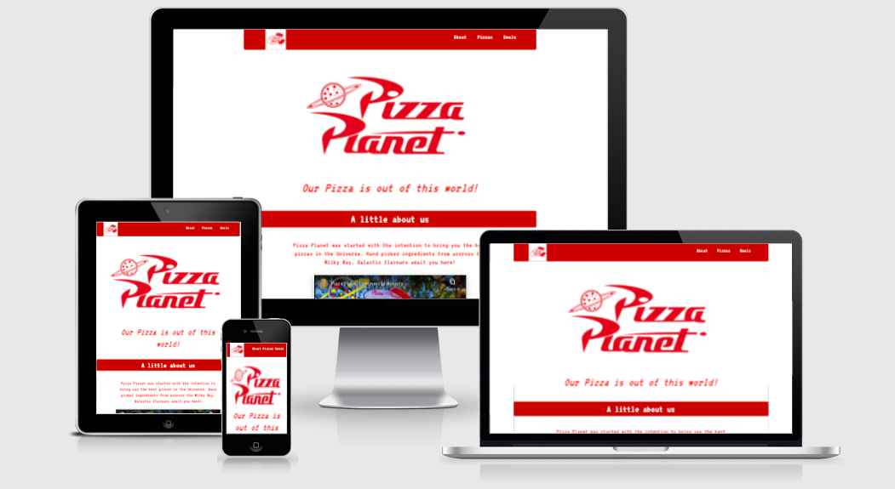
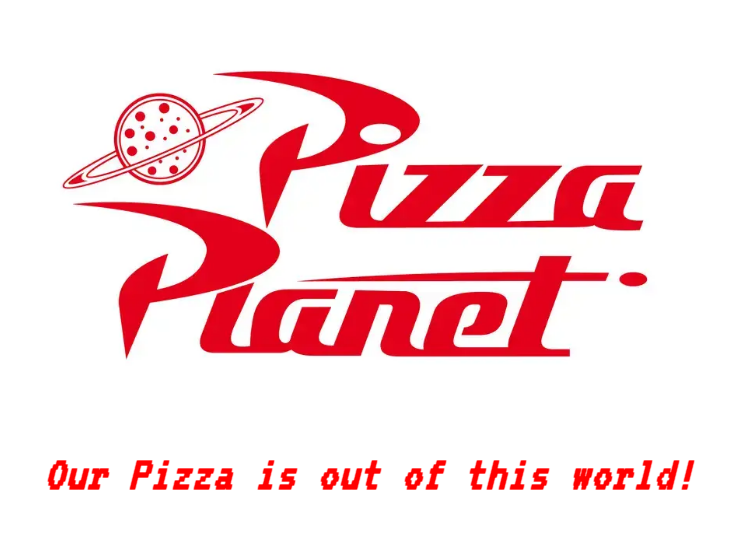
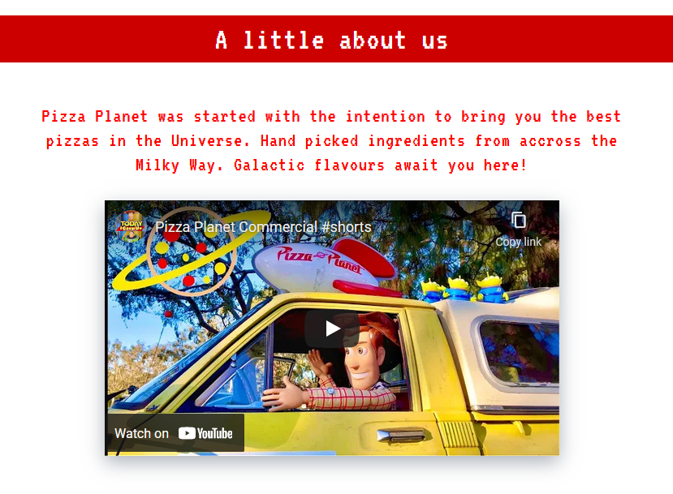
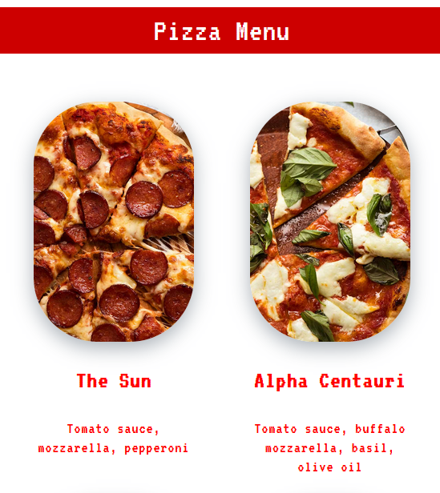
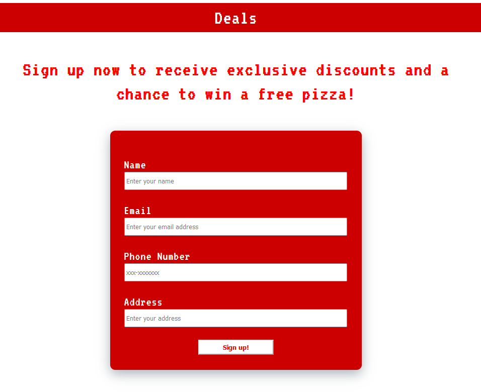
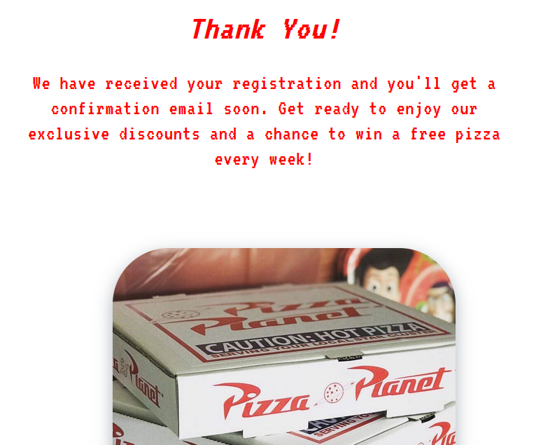
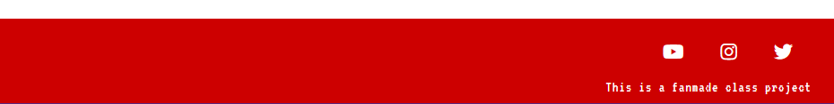
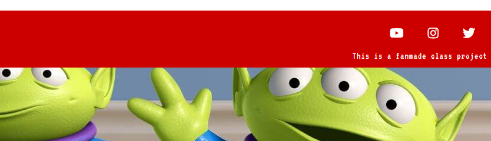

# Pizza Planet

Pizza Planet is a family friendly pizza restaurant with a space theme. Its website was designed as a single page to be simple to read and use on both desktops and mobile devices. The centered column-like style of the page is meant to keep the user's eyes from having to wander too far to find what they're looking for.

The site displays the restaurant's logo upfront followed by a small description along with a promotional video. It also has a pizza menu and a Sign-up form to receive deals in the user's email inbox as well as a chance to win free pizzas.

# Features

## Navigation Bar

- The navigation bar sits permanently at the top of the page
- Has the logo which acts as a Home link on the left and section links to the right

## Landing Section

- A large Pizza Planet logo and the restaurant's signature phrase are the first thing to catch the eye
- It establishes the brand to the user and sets the color code of the website

## About Section

- A brief paragraph with a sales pitch about the business's products
- Includes a fun promotional video about the restaurant's delivery option

## Pizza Menu

- Has a picture of each pizza available along with its themed name and toppings
- The pictures slightly zoom in when the user's mouse hovers over them to provide a more interactive feel 

## Deals Sign Up

- This section offers the user the opportunity to sign up to a mailing list in order to get discounts and a chance to win free pizzas
- The form asks for their name, email, phone number and address

## Confirmation Page

- This page is where the user is taken when they correctly fill out the Deals form and click the ***Sign up!*** button 
- It assures the user that they are enrolled in the restaurant's mailing list

## Footer

- The footer contains the restaurant's social media links
- This gives the user more options to stay informed about the business
- The links will open in a new tab for ease of navigation

## Hidden Feature

- An image is hidden underneath the footer on the main page
- This is supposed to give the user a simple extra experience adding to the fun aspect of the business

# Testing

I wanted the website to look similar whether on mobile or desktop devices. From the beginning I planned the layout in a way that would make it easier for me to code responsive pages. That's why aside from the Confirmation page which comes after signing up, the Main website is made as a single page with links to sections of the page.

## Navigation Bar

I gave the nav bar a maximum width so in wider desktop screens the user wouldn't have to reach or look too far in order to navigate the page.  
From the Confirmation page if the user clicks on any of the links in the nav bar, they'll be sent to the Main page and to the corresponding section.

## Main Logo

The big logo was styled in a way that it could conform to the viewport's size. On mobile or desktop, I wanted it to be large and draw attention, but it shouldn't be wider than the width of the viewport. It's width was set to 100% with height set to *auto*.#

## Embedded Video

In the about section there is an embedded youtube video. It was very important that the video wouldn't be too big or have any black bars.

https://css-tricks.com/fluid-width-video/

bug: when clicking links on the navbar, the navbar would land on top of the heading

https://css-tricks.com/the-slideout-footer/

https://medium.com/@bretcameron/parallax-images-sticky-footers-and-more-8-useful-css-tricks-eef12418f676

https://getcssscan.com/css-box-shadow-examples