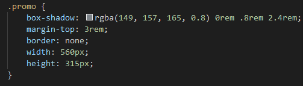
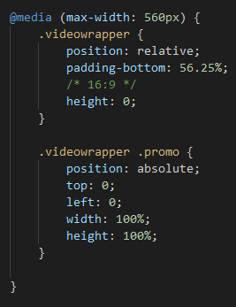
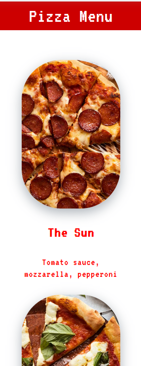
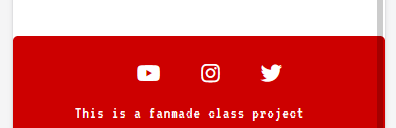
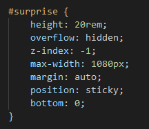
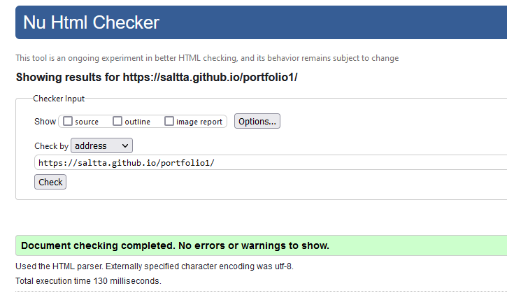
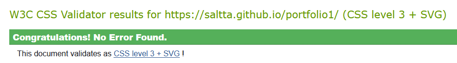
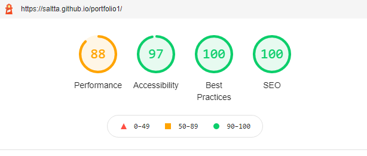
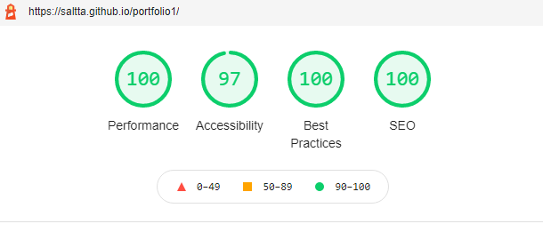

# Pizza Planet

Pizza Planet is a family friendly pizza restaurant with a space theme. Its website was designed as a single page to be simple to read and use on both desktops and mobile devices. The centered column-like style of the page is meant to keep the user's eyes from having to wander too far to find what they're looking for.

The site displays the restaurant's logo upfront followed by a small description along with a promotional video. It also has a pizza menu and a Sign-up form to receive deals in the user's email inbox as well as a chance to win free pizzas.

# Features

## Navigation Bar

- The navigation bar sits permanently at the top of the page
- Has the logo which acts as a Home link on the left and section links to the right

## Landing Section

- A large Pizza Planet logo and the restaurant's signature phrase are the first thing to catch the eye
- It establishes the brand to the user and sets the color code of the website

## About Section

- A brief paragraph with a sales pitch about the business's products
- Includes a fun promotional video about the restaurant's delivery option

## Pizza Menu

- Has a picture of each pizza available along with its themed name and toppings
- The pictures slightly zoom in when the user's mouse hovers over them to provide a more interactive feel 

## Deals Sign Up

- This section offers the user the opportunity to sign up to a mailing list in order to get discounts and a chance to win free pizzas
- The form asks for their name, email, phone number and address

## Confirmation Page

- This page is where the user is taken when they correctly fill out the Deals form and click the ***Sign up!*** button 
- It assures the user that they are enrolled in the restaurant's mailing list

## Footer

- The footer contains the restaurant's social media links
- This gives the user more options to stay informed about the business
- The links will open in a new tab for ease of navigation

## Hidden Feature

- An image is hidden underneath the footer on the main page
- This is supposed to give the user a simple extra experience adding to the fun aspect of the business

# Testing

I wanted the website to look similar whether on mobile or desktop devices. From the beginning I planned the layout in a way that would make it easier for me to code responsive pages. That's why aside from the Confirmation page which comes after signing up, the Main website is made as a single page with links to sections of the page.

## Navigation Bar

I gave the nav bar a maximum width so in wider desktop screens the user wouldn't have to reach or look too far in order to navigate the page.  
From the Confirmation page if the user clicks on any of the links in the nav bar, they'll be sent to the Main page and to the corresponding section.  
It was important to separate the logo, which is also the home link, from the other section links. This was achieved by using flex-box on the nav bar.
The bar is fixed to the top of the page at all times so the user can navigate with ease.

## Main Logo

The big logo was styled in a way that it could conform to the viewport's size. On mobile or desktop, I wanted it to be large and draw attention, but it shouldn't be wider than the width of the viewport. It's *width* was set to *100%* with *height* set to *auto*.#

## Embedded Video

In the about section there is an embedded youtube video. It was very important that the video wouldn't be too big or have any black bars. It has a maximum width and shrinks down conforming to smaller screens.

- The CSS for the video

## Images

I styled the images, aside from the small logo on the nav bar, to look a little more rounded along with the overall corners in the sections' titles.  
I also wanted the pizzas in the menu to have a little zoom in effect when hovered to add a little interactive feel to them. This was achieved adding a *transform* property to its *:hover* selector and setting its value to *scale* 20% larger than the original.  
In the smaller screens the pizzas stack in a single column while on larger screens they are in 2 columns.

- Pizzas as seen on a smaller mobile device

## Form

The form was designed to sit in a box which was centered in the page. On smaller screens it fills out the width and has no white space on the sides.  
The submit button was styled to comply with the overall page font and color code.  
The form, when correctly filled out, is set to lead to the Confirmation page.

## Footer

The footer contains social links using Font Awesome for better visuals.  
It is designed to sit off to the right of the page but centers when in small screens.

- Footer seen on small screens

## Hidden Image

The idea was to make a little surprise for the user with the intention of it feeling like an easter-egg and to also increase the value of the user experience.  
When scrolling down the page the footer comes up revealing the image behind it. This was done by placing the image in a separate *div* and giving it a *z-index* of *-1*, a *position* set to *sticky* and *bottom* set to *0*.

- The CSS for the surprise image

## Validators

No errors were shown when running the website through both HTML and CSS validators.

- HTML validator

- CSS validator

- Lighthouse tested for mobile

- Lighthouse tested for desktop

The Lighthouse tests had good scores, however results were sometimes different just by running Lighthouse again without any changes to the page itself.  

The site was opened of 6 different mobile devices using either Android or iOS, and 3 separate desktop browsers, the navigation worked well in all of them.

## Bugs
 
### Nav Bar

Due to its fixed position, the nav bar ended up on top of the headings for each section when clicking on its links.  

The solution was to add the property *scroll-padding-top* and give it a value that would push the page down enough for the heading to clear the nav bar. I chose *80px* because it felt like a visually pleasant position.

### Youtube Video

Making the Youtube embedded video responsive was a little tricky because depending on the screen size it would either deform the image, or if I gave it a fixed aspect ratio it would stretch the page and bleed off the side of the viewport. 

Then there was also the problem that the video image would change size but the box containing that image would keep its own size thus producing black bars around the video. When using *media* calls for small screens, I tried using *width* of *100%* and *height* set to *auto* and this would happen. 

This was fixed by using a solution I found in a tutorial which will be linked below in the **Credits**. It involves putting Youtube's *iframe* into a *div* and *position* the video as *absolute* to that container to make it fluid.

## Deployment

- The site was deployed to GitHub pages. The steps to deploy are as follows: 
  - In the GitHub repository, navigate to the Settings tab.
  - In the left sidebar click on Pages.
  - In the Source drop-down menu, select the Main branch.
  - Click Save.

The live link can be found here - https://saltta.github.io/pizzaplanet/

https://css-tricks.com/fluid-width-video/

bug: when clicking links on the navbar, the navbar would land on top of the heading

https://css-tricks.com/the-slideout-footer/

https://medium.com/@bretcameron/parallax-images-sticky-footers-and-more-8-useful-css-tricks-eef12418f676

https://getcssscan.com/css-box-shadow-examples